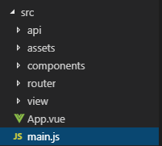
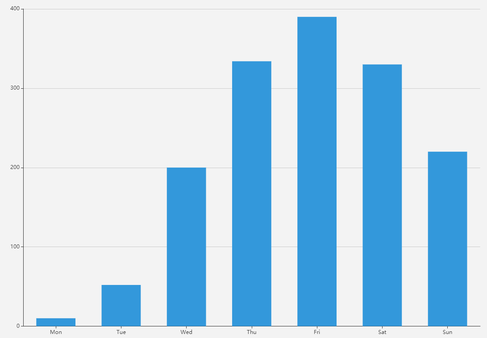
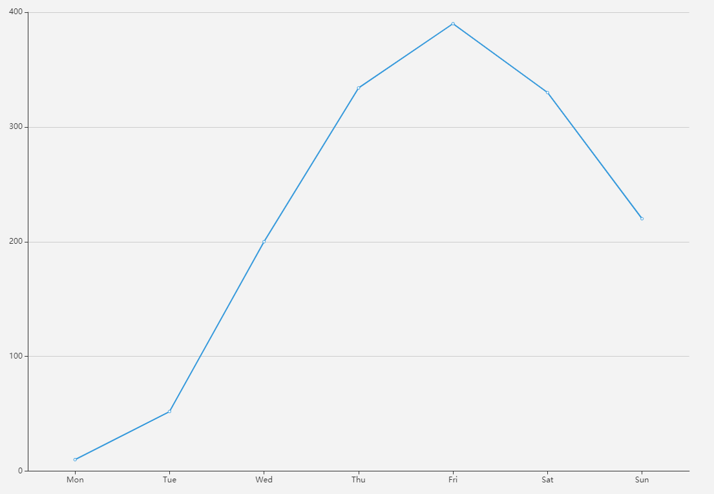
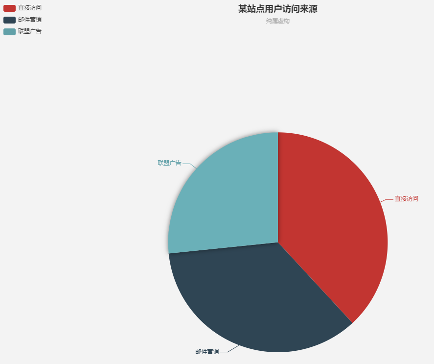
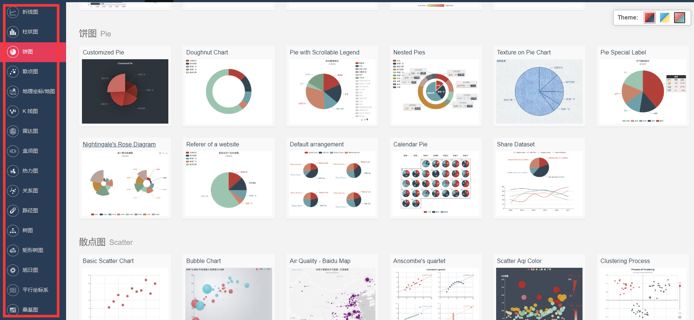

# 方便的EChart------使用图表展示数据

## 1. 介绍
这是我在项目中使用的图形库，这也是一款基于HTML5的图形库。图形的创建也比较简单，直接引用Javascript即可。使用这个库的原因主要有三点：
- 这个库是百度的项目，而且一直有更新，目前最新的是EChart 3
- 这个库的项目文档比较详细，每个点都说明的比较清楚，而且是中文的，理解比较容易
- 这个库支持的图形很丰富，并且可以直接切换图形，使用起来很方便

## 2. 安装

[具体安装可上官网查看](https://echarts.baidu.com/download.html)
可以使用 npm 安装 ECharts：

```
npm install echarts

```
## 3. 在Vue框架中使用

### 3.1 调用

在Vue框架的src文件下的main.js中写入：

```
import echarts from 'echarts'
Vue.prototype.$echarts = echarts
```

在需要使用到ECharts的vue中的<script>加入：

```
import echarts from 'echarts'
```

### 3.2 具体使用

#### 3.2.1 柱状图

作为一个控件使用，在<style>中设置其长宽等基础样式与普通的控件一样

```
<div id="myChart" style="width:100%; height:400px;"></div>
```

通过一个函数 drawLine() 来进行对图表 "myChart" 的绘制

```
drawLine () {
  // 基于准备好的dom，初始化echarts实例
  let myChart = this.$echarts.init(document.getElementById('myChart'))
  // 绘制图表
  myChart.setOption({
    color: ['#3398DB'],
    tooltip : {
      trigger: 'axis',
      axisPointer : {            // 坐标轴指示器，坐标轴触发有效
        type : 'shadow'        // 默认为直线，可选为：'line' | 'shadow'
      }
    },
    grid: {
      left: '3%',
      right: '4%',
      bottom: '3%',
      containLabel: true
    },
    xAxis : [
      {
        type : 'category',
        data : ['Mon', 'Tue', 'Wed', 'Thu', 'Fri', 'Sat', 'Sun'],
        axisTick: {
          alignWithLabel: true
        }
      }
    ],
    yAxis : [{
      type : 'value'
    }],
    series : [{
      name:'直接访问',
      type:'bar',
      barWidth: '60%',
      data:[10, 52, 200, 334, 390, 330, 220]
    }]
  })
},
```

这样绘制出来的图就是：


#### 3.2.2 折线图

同样折线图也一样，只要修改一个参数就可以了，把series里的type 值修改为 ‘line'


#### 3.2.3 饼图

饼图和折线图、柱状图有一点区别。主要是在参数和数据绑定上。饼图没有X轴和Y轴的坐标，数据绑定上也是采用value 和name对应的形式。

```
drawLine () {
  // 基于准备好的dom，初始化echarts实例
  let myChart = this.$echarts.init(document.getElementById('myChart'))
  // 绘制图表
  myChart.setOption({
    title : {
      text: '某站点用户访问来源',
      subtext: '纯属虚构',
      x:'center'
    },
    tooltip : {
      trigger: 'item',
      formatter: "{a} <br/>{b} : {c} ({d}%)"
    },
    legend: {
      orient: 'vertical',
      left: 'left',
      data: ['直接访问','邮件营销','联盟广告']
    },
    series : [
      {
        name: '访问来源',
        type: 'pie',
        radius : '55%',
        center: ['50%', '60%'],
        data:[
          {value:335, name:'直接访问'},
          {value:310, name:'邮件营销'},
          {value:234, name:'联盟广告'},
        ],
        itemStyle: {
          emphasis: {
            shadowBlur: 10,
            shadowOffsetX: 0,
            shadowColor: 'rgba(0, 0, 0, 0.5)'
          }
        }
      }
    ]
  })
},
```
这样绘制出来的图就是：


## 其他
[此外还有许多图及样式可使用](https://www.echartsjs.com/examples/)
